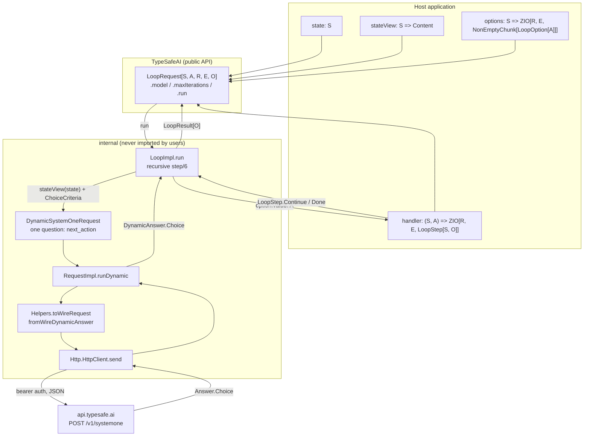
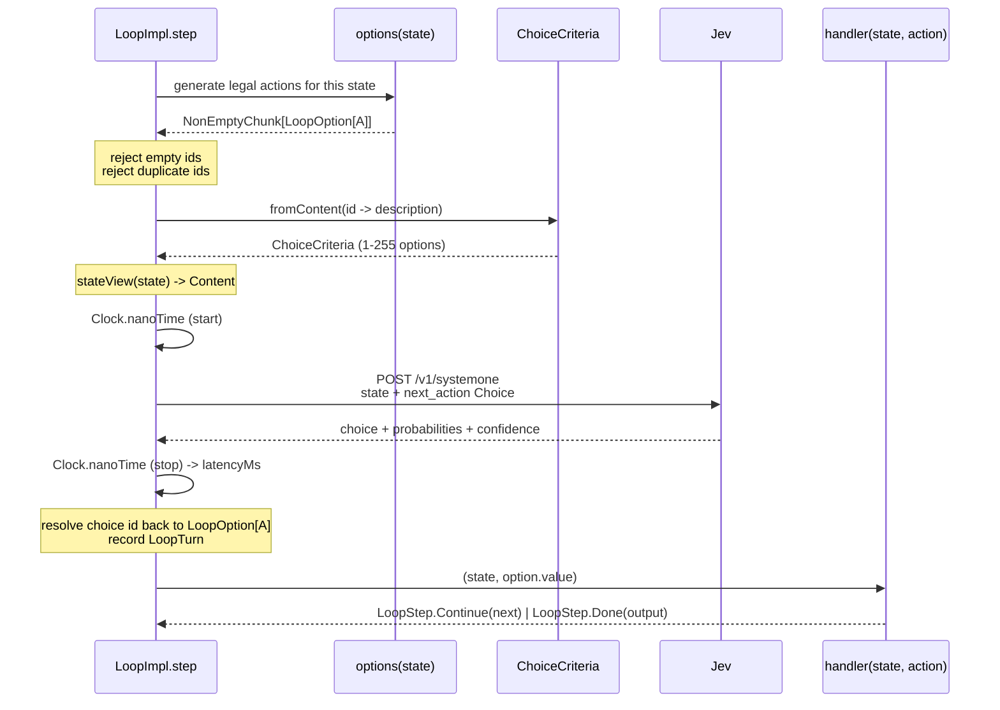
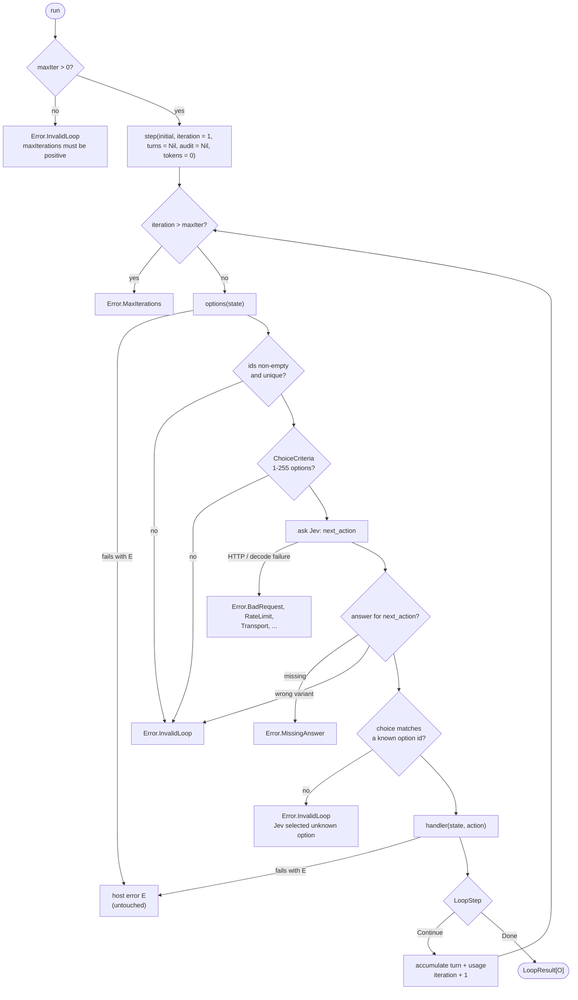
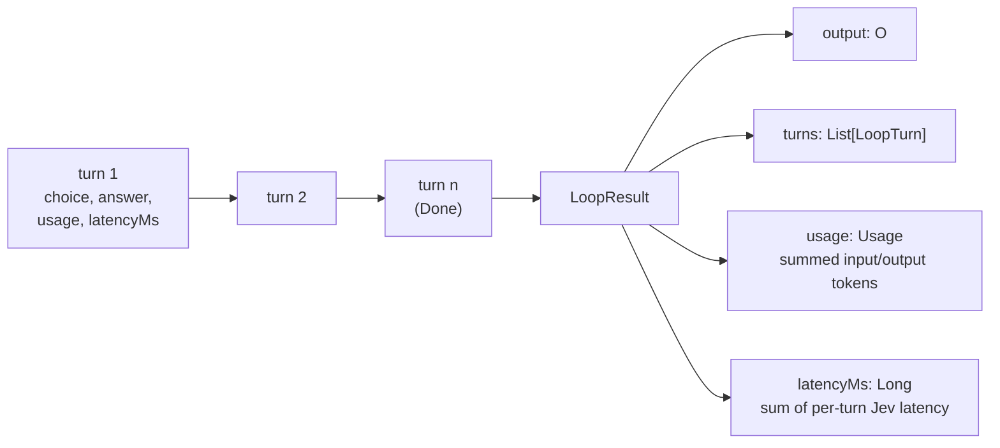

# Jev loop architecture

`TypeSafeAI.loop` turns Jev — a System One model that only answers typed,
atomic questions — into the outer decision loop of an application state
machine. Jev never generates an action; on every iteration the host
generates the *entire* finite set of legal actions and Jev answers one
`Question.Choice`: "which of these advances the state?"

That inversion is the whole design. The host owns the state type `S`, the
action type `A`, effects, and termination; Jev owns exactly one decision per
turn, and that decision is a calibrated probability distribution over ids the
host minted itself.

## Components

`LoopImpl` reaches Jev through `DynamicSystemOneRequest`, not the typed
`ask` path. It has to: the option set is built at runtime, so there is no
compile-time `NamedTuple` to key the answer by. The loop pays for that with a
runtime map lookup on the fixed id `next_action` and an explicit variant
match on `DynamicAnswer`.

## One iteration

The loop request sends the serialized `Content` state view, model and question
metadata, configurable choice instructions, and each option's id and
*description*. `LoopOption` keeps `id`, `value: A`, and `description: Content`
separate precisely so the host's real action value never has to be serializable
or cross the wire — Jev sees the id/description pair, and the host maps the
selected id back to `A`.

Option ids are opaque to Jev by construction. The question text says so
("Option ids are opaque; judge their structured descriptions"), which keeps
a terse id like `finish` from doing semantic work the description should be
doing.

## Control flow and exits

Every validation gate runs *per iteration*, not once at build time, because
`options` is a function of the current state — a host that returns a
duplicate id only in some late state fails there, before anything is sent.

The error channel is the union `Error | E`, and the environment is
`Client & R`. Host failures pass through unwidened: a loop over a database
never has to wrap its own errors in a library error type, and `E = Nothing`
(as in the counter example) collapses the union back to `Error`.

## What accumulates

`LoopTurn` records the *full* `ChoiceAnswer`, not just the selected id — the
probability distribution over every option and Jev's confidence are kept for
each decision, which is what makes a loop auditable after the fact ("it chose
`escalate`, but `retry` was at 0.46").

Two things the aggregates deliberately do not include:

- **`latencyMs` is Jev time only.** It is measured around the HTTP call and
  summed across turns, so it excludes whatever the handler spent doing real
  work. It answers "how much of this loop was the model?", not "how long did
  this loop take".
- **`usage` is Jev tokens only.** A handler that calls a generative model
  reports its own usage through its own channel.

The turn is recorded *before* the handler runs, so a handler that fails still
leaves its decision in the reconstructed history when the failure is caught
and inspected upstream.

## Why the handler is the escape hatch

`handler` returns `ZIO[R, E, LoopStep[S, O]]`, so an action can do anything a
ZIO can do — an MCP call, a database write, a generative model call with no
tools — while Jev stays the outer loop. This is the opposite of tool-calling:
instead of a generative model emitting a tool name it might hallucinate, a
System One model picks from a set that the host proved legal for this exact
state, and the picked value is already the typed `A` the handler expects.

`Error.InvalidLoop("Jev selected unknown option ...")` is therefore a
protocol violation, not a normal outcome — it can only fire if the model
returns an id outside the criteria it was given.

## Probability-aware transitions

The default `loop` handler receives `(state, action)` and remains the concise API for greedy state machines. `loopWithTurn` receives `(state, action, turn)` instead. `LoopImpl` constructs the `LoopTurn` before invoking either handler, so probability-aware code can inspect the selected option probability, all alternative probabilities, confidence, usage, iteration, and latency while deciding the next state.

This is required for hierarchical search: a handler can retain several branches from `turn.answer.probabilities`, store that frontier in state, and generate the next level's legal options on the following recursive iteration. The final `LoopResult.turns` remains the complete audit history for both APIs.

## Observation, retries, and audit

A `LoopObserver[E, O]` receives semantic events rather than transport attempts. Within each iteration the fixed order is:

1. generate and validate the complete option set;
2. emit `LoopObservation.OptionsGenerated` with the `Content` state view and id/description metadata;
3. run Jev (including any configured physical retries);
4. resolve the selected id and emit `LoopObservation.Decision`;
5. invoke the existing turn-aware handler;
6. recurse or emit `LoopObservation.Completion`.

The outermost execution boundary alone emits `LoopObservation.Failure`, so recursive failure propagation cannot duplicate notifications. Its `Cause[Error | E]` preserves typed failures, defects, and interruption for unconstrained host `E`, and its turn list includes every successfully resolved decision, including one whose handler subsequently failed. All observer callbacks are best-effort: callback defects and self-interruption are safely logged and suppressed without replacing the loop result or cause.

`LoopRetryPolicy` wraps only `DynamicSystemOneRequest.run` for the current turn. `RateLimit`, `ServiceOverloaded`, and `InternalServer` are retried up to `maxRetries`; no other error is. Options, state rendering, semantic observers, handler effects, and recursion sit outside that boundary and therefore execute once per logical turn. A turn's `latencyMs` includes every physical attempt and exponential-backoff wait. Its `usage` is the successful response's reported usage; failed HTTP responses have no usage payload to aggregate. `ExchangeObserver`, when installed on the client, still sees every physical attempt.

`choiceInstructions` stores a `Content` value. The historical sentence remains the default (and preserves the exact default request shape), while a custom `Schema` value retains its JSON string/object/array/null structure.

`runAudited` adds one `LoopAuditTurn(iteration, stateView, options)` after each successfully resolved decision. Audit options retain only id and `Content` description, never the host action `A`. This is intentionally separate from `LoopTurn` so neither `LoopTurn` nor `LoopResult` changes arity. `AuditedLoopResult` delegates the ordinary result accessors. Ordinary `run` returns the unchanged `LoopResult` and does not retain audit snapshots. Audit state/options can be sensitive and memory use grows with both turn count and option-set size.
